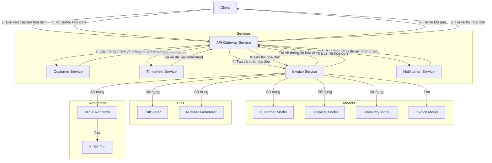

```mermaid
graph TD
    Client[Client] -->|1. Gửi yêu cầu tạo hóa đơn| ApiGateway[API Gateway Service]
    
    subgraph Services
        ApiGateway -->|2. Lấy thông tin khách hàng| CustomerService[Customer Service]
        ApiGateway -->|3. Lấy dữ liệu timesheet| TimesheetService[Timesheet Service]
        ApiGateway -->|4. Tạo và xuất hóa đơn| InvoiceService[Invoice Service]
        ApiGateway -->|5. Gửi thông báo| NotificationService[Notification Service]
        
        CustomerService -->|Trả về thông tin khách hàng| ApiGateway
        TimesheetService -->|Trả về dữ liệu timesheet| ApiGateway
        InvoiceService -->|Trả về thông tin hóa đơn| ApiGateway
        NotificationService -->|Xác nhận đã gửi thông báo| ApiGateway
    end
    
    subgraph Models
        InvoiceService -->|Sử dụng| Customer[Customer Model]
        InvoiceService -->|Sử dụng| Template[Template Model]
        InvoiceService -->|Sử dụng| TimeEntry[TimeEntry Model]
        InvoiceService -->|Tạo| InvoiceModel[Invoice Model]
    end
    
    subgraph Utils
        InvoiceService -->|Sử dụng| Calculator[Calculator]
        InvoiceService -->|Sử dụng| NumberGenerator[Number Generator]
    end
    
    subgraph Renderers
        InvoiceService -->|Sử dụng| XlsxRenderer[XLSX Renderer]
        XlsxRenderer -->|Tạo| XlsxFile[XLSX File]
    end
    
    ApiGateway -->|6. Trả về kết quả| Client
    Client -->|7. Tải xuống hóa đơn| ApiGateway
    ApiGateway -->|8. Lấy file hóa đơn| InvoiceService
    InvoiceService -->|Trả về file hóa đơn| ApiGateway
    ApiGateway -->|9. Trả về file hóa đơn| Client
```
